# Verzel Store - Testes de API
 
## Objetivo
 
Validar os endpoints da API da Verzel Store, garantindo a integridade dos dados, os cálculos do carrinho, a aplicação das regras de negócio, a criação de pedidos e os retornos de erro documentados.
 
## Escopo
 
### Endpoints Validados
 
- GET /api/produtos/{id}
- POST /api/carrinho/calcular
- POST /api/pedidos
 
## Resumo da Execução
 
| Caso de Teste | Status |
|---------------|---------|
| CT13 | ✅ Aprovado |
| CT14 | ✅ Aprovado |
| CT15 | ✅ Aprovado |
| CT16 | ✅ Aprovado |
| CT17 | ✅ Aprovado |
| CT18 | ✅ Aprovado |
| CT19 | ✅ Aprovado |
| CT20 | ✅ Aprovado |
| CT21 | ✅ Aprovado |
 
---
 
# CT13 - Consultar individualmente os produtos cadastrados
 
## Cenário
 
```gherkin
Scenario: Consultar individualmente os produtos cadastrados
 
Given que possuo os identificadores dos produtos cadastrados
When realizo uma consulta individual dos produtos através do endpoint "/api/produtos/{id}"
Then o status code da resposta deve ser 200
And os dados do produto consultado devem ser retornados corretamente
And os campos id, nome, descrição, categoria e preço devem ser apresentados corretamente
```
 
## Status
 
✅ APROVADO
 
## Evidências
 
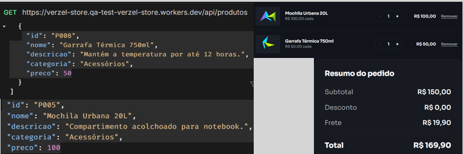
---
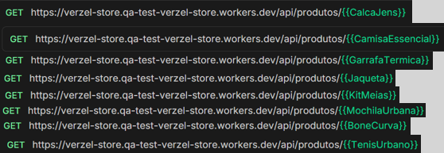
---
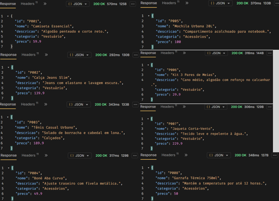

## Observações
 
Foram realizadas consultas individuais para os produtos cadastrados utilizando o endpoint GET /api/produtos/{id}. Todos os produtos retornaram status code 200 e apresentaram corretamente os dados esperados.
---
Durante a análise, foi identificado que os produtos P005 e P008 retornam os valores 100 e 50 no endpoint de listagem geral, enquanto os demais produtos são retornados com casas decimais, como 59.9, 139.9 e 229.9.
---
Diante dessa diferença de representação, foi realizada uma validação complementar no Front-End. Foi constatado que o produto P005 é exibido corretamente como R$ 100,00 e o produto P008 como R$ 50,00, mantendo o mesmo padrão visual aplicado aos demais produtos da loja.
---
Além disso, os valores foram refletidos corretamente nos cálculos de subtotal, desconto, frete e total durante as validações realizadas, sem provocar inconsistências na aplicação.
---
Conclusão: embora exista uma diferença no formato de apresentação dos valores entre alguns produtos retornados pela API, não foi identificado impacto funcional para o usuário nem divergência em relação à regra de arredondamento definida no CA11.
 
---
 
# CT14 - Calcular corretamente os valores do carrinho sem cupom de desconto
 
## Cenário
 
```gherkin
Scenario: Calcular corretamente os valores do carrinho sem cupom de desconto
 
Given que possuo produtos válidos para cálculo do carrinho
And não informo um cupom de desconto
When envio uma requisição para o endpoint "/api/carrinho/calcular"
Then o status code da resposta deve ser 200
And o subtotal deve corresponder à soma dos produtos enviados
And o valor do desconto deve ser igual a zero
And o valor do frete deve ser calculado conforme a regra de negócio
And o valor total deve corresponder à fórmula subtotal menos desconto mais frete
```
 
## Status
 
✅ APROVADO
 
## Evidências
 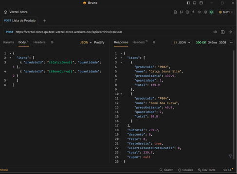 
## Observações
 
Foi realizada uma requisição ao endpoint POST /api/carrinho/calcular sem informar cupom de desconto. A resposta retornou status code 200 e os valores de subtotal, desconto, frete e total foram calculados corretamente conforme as regras definidas na documentação.
 
---
 
# CT15 - Aplicar cupom de desconto válido no cálculo do carrinho
 
## Cenário
 
```gherkin
Scenario: Aplicar cupom de desconto válido no cálculo do carrinho
 
Given que possuo produtos válidos para cálculo do carrinho
And informo o cupom de desconto "BEMVINDO10"
When envio uma requisição para o endpoint "/api/carrinho/calcular"
Then o status code da resposta deve ser 200
And o cupom deve ser aplicado com sucesso
And o desconto deve corresponder a 10% do subtotal dos produtos
And o valor total deve ser calculado corretamente
```
 
## Status
 
✅ APROVADO
 
## Evidências
 
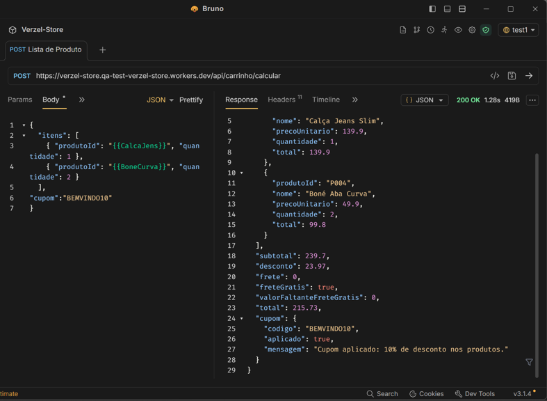
 
## Observações
 
Foi realizada uma requisição ao endpoint POST /api/carrinho/calcular utilizando o cupom BEMVINDO10. O desconto de 10% foi aplicado corretamente e os valores retornados permaneceram consistentes com as regras de cálculo da aplicação.
 
---
 
# CT16 - Calcular carrinho com cupom de desconto inexistente
 
## Cenário
 
```gherkin
Scenario: Calcular carrinho com cupom de desconto inexistente
 
Given que possuo produtos válidos para cálculo do carrinho
And informo o cupom de desconto "CUPOMTESTE"
When envio uma requisição para o endpoint "/api/carrinho/calcular"
Then o status code da resposta deve ser 200
And nenhum desconto deve ser aplicado
And a mensagem retornada deve ser "Cupom inválido."
```
 
## Status
 
✅ APROVADO
 
## Evidências
 
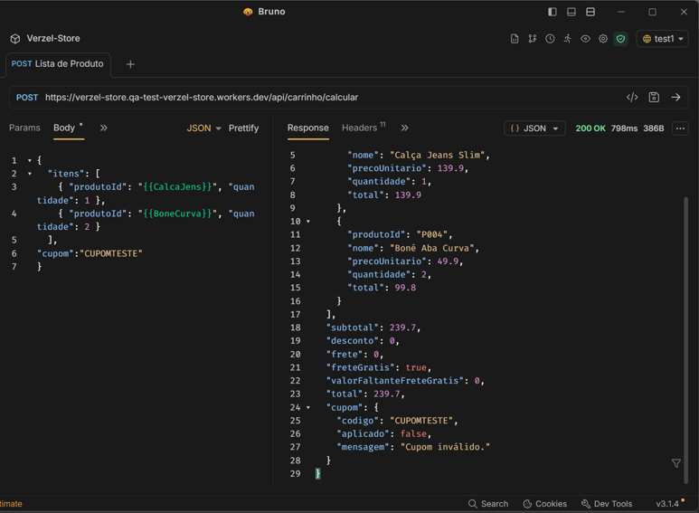 
## Observações
 
A API retornou status code 200, manteve os valores originais do carrinho e apresentou corretamente a mensagem "Cupom inválido.", sem aplicar qualquer desconto ao pedido.
 
---
 
# CT17 - Calcular carrinho com cupom de desconto expirado
 
## Cenário
 
```gherkin
Scenario: Calcular carrinho com cupom de desconto expirado
 
Given que possuo produtos válidos para cálculo do carrinho
And informo o cupom de desconto "VERAO2026"
When envio uma requisição para o endpoint "/api/carrinho/calcular"
Then o status code da resposta deve ser 200
And nenhum desconto deve ser aplicado
And a mensagem retornada deve ser "Cupom expirado."
```
 
## Status
 
✅ APROVADO
 
## Evidências
 
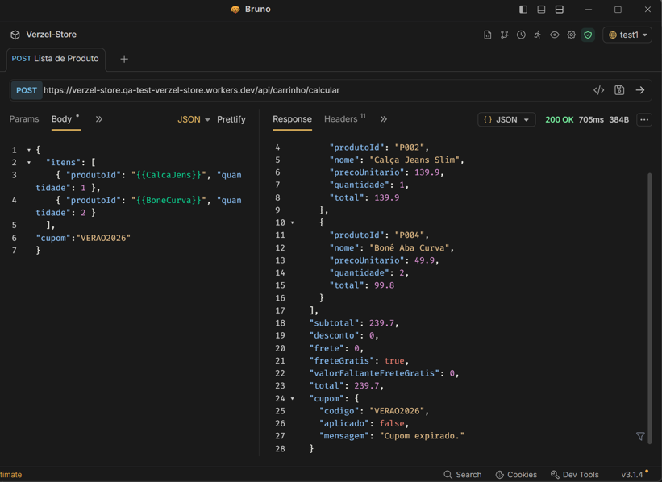
 
## Observações
 
A API retornou status code 200, não aplicou desconto ao carrinho e apresentou corretamente a mensagem "Cupom expirado.", conforme previsto na documentação.
 
---
 
# CT18 - Rejeitar pedido com cupom inválido
 
## Cenário
 
```gherkin
Scenario: Rejeitar pedido com cupom inválido
 
Given que possuo produtos válidos para criação do pedido
And informo dados válidos do cliente
And informo o cupom de desconto "CUPOMTESTE"
When envio uma requisição para o endpoint "/api/pedidos"
Then o status code da resposta deve ser 422
And a mensagem retornada deve ser "Cupom inválido."
```
 
## Status
 
✅ APROVADO
 
## Evidências
 
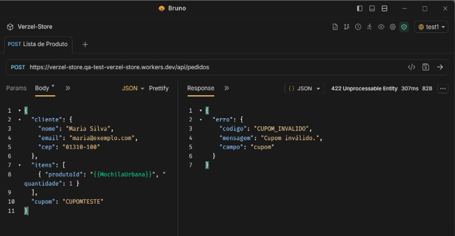
 
## Observações
 
Foi validado o comportamento do endpoint POST /api/pedidos ao receber um cupom inexistente. A requisição foi rejeitada corretamente com status code 422 e mensagem compatível com a regra documentada.
 
---
 
# CT19 - Rejeitar pedido com cupom expirado
 
## Cenário
 
```gherkin
Scenario: Rejeitar pedido com cupom expirado
 
Given que possuo produtos válidos para criação do pedido
And informo dados válidos do cliente
And informo o cupom de desconto "VERAO2026"
When envio uma requisição para o endpoint "/api/pedidos"
Then o status code da resposta deve ser 422
And a mensagem retornada deve ser "Cupom expirado."
```
 
## Status
 
✅ APROVADO
 
## Evidências
 
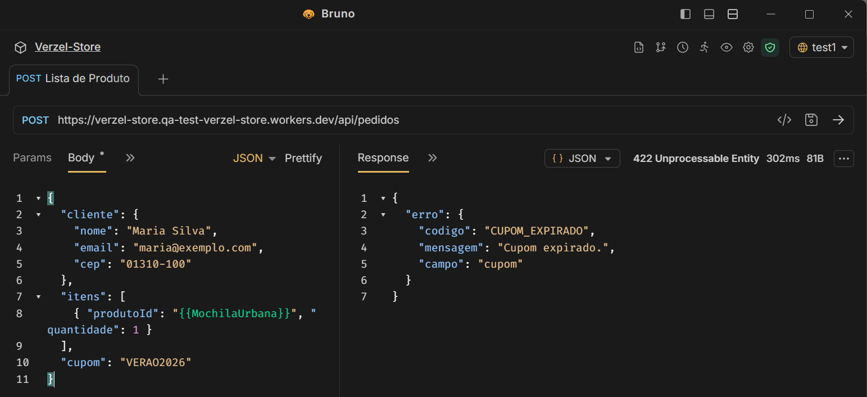
 
## Observações
 
Foi validado o comportamento do endpoint POST /api/pedidos ao receber um cupom expirado. A API retornou corretamente status code 422 e mensagem compatível com a condição de erro esperada.
 
---
 
# CT20 - Confirmar pedido com sucesso
 
## Cenário
 
```gherkin
Scenario: Confirmar pedido com sucesso
 
Given que possuo produtos válidos para criação do pedido
And informo dados válidos do cliente
When envio uma requisição para o endpoint "/api/pedidos"
Then o status code da resposta deve ser 201
And o número do pedido deve ser retornado no formato "VZ-000000"
And o resumo dos valores do pedido deve ser calculado corretamente
```
 
## Status
 
✅ APROVADO
 
## Evidências
 
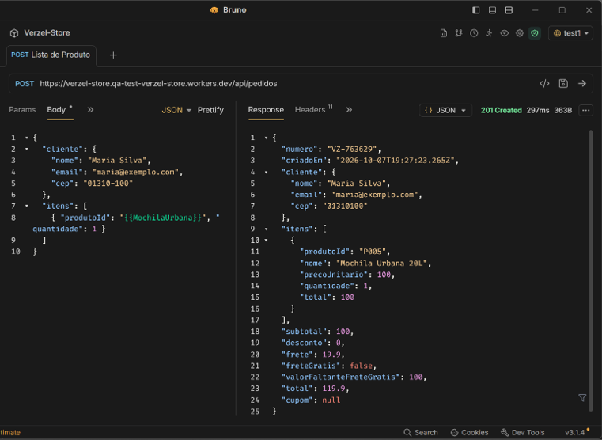 
## Observações
 
O pedido foi criado com sucesso através do endpoint POST /api/pedidos. A resposta retornou status code 201, número do pedido gerado e resumo financeiro compatível com os valores enviados na requisição.
 
---
 
# CT21 - Rejeitar pedido com quantidade igual a zero
 
## Cenário
 
```gherkin
Scenario: Rejeitar pedido com quantidade igual a zero
 
Given que possuo um produto válido para criação do pedido
And informo a quantidade do produto igual a 0
When envio uma requisição para o endpoint "/api/pedidos"
Then o status code da resposta deve ser 422
And o código do erro deve ser "QUANTIDADE_INVALIDA"
And a mensagem deve ser "A quantidade deve ser um número inteiro maior ou igual a 1."
And o campo inválido deve ser "itens[0].quantidade"
```
 
## Status
 
✅ APROVADO
 
## Evidências
 
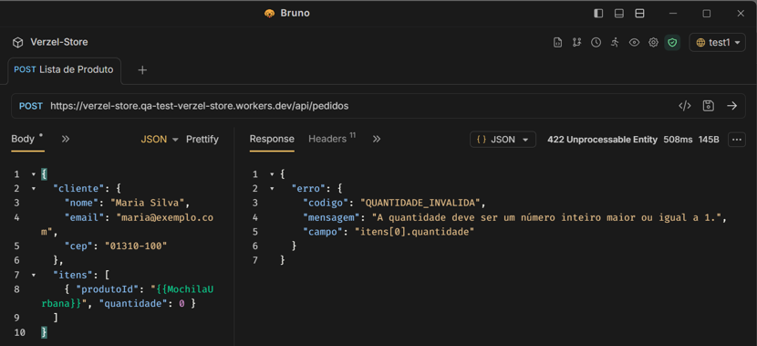
 
## Observações
 
Foi realizada uma requisição informando quantidade igual a zero para um produto válido. A API rejeitou a solicitação conforme esperado, retornando o código QUANTIDADE_INVALIDA, a mensagem correspondente e identificando corretamente o campo responsável pela inconsistência.
 
---
 
## Conclusão
 
Todos os 9 casos de teste de API foram aprovados.
 
Os endpoints validados demonstraram aderência às regras de negócio documentadas, apresentando cálculos consistentes, aplicação correta de cupons, validações de dados de entrada e tratamento adequado dos cenários de erro.
 
### Resultado Final
 
- Total de Casos de Teste API: 9
- Aprovados: 9
- Reprovados: 0
 
✅ Não foram identificadas divergências funcionais durante a execução dos testes de API.