# Verzel Store - Testes de Automação

## Objetivo

Documentar os testes automatizados de ponta a ponta da Verzel Store, incluindo os cenários executados, os resultados esperados e as evidências capturadas pelo Playwright durante cada etapa.

## Escopo

Validação da jornada de compra, incluindo seleção de produtos, aplicação de cupom, preenchimento dos dados do cliente e confirmação do pedido.

## Resumo da Execução

| Caso de Teste | Status |
|---------------|---------|
| CT01 | ✅ Aprovado |
| CT02 | ✅ Aprovado |
| CT03 | ✅ Aprovado |

---

# CT01 - Jornada de compra com cupom válido

## Cenário

```gherkin
Scenario: Concluir uma compra utilizando um cupom válido

Given que acesso a loja e adiciono os produtos P002 e P003 ao carrinho
When aplico o cupom válido "BEMVINDO10"
And preencho os dados do cliente no checkout
And confirmo o pedido
Then o sistema deve informar que o cupom foi aplicado
And deve aplicar 10% de desconto sobre o subtotal elegível
And deve exibir a confirmação do pedido
And devo conseguir retornar à loja
```

## Status

✅ APROVADO

## Evidências


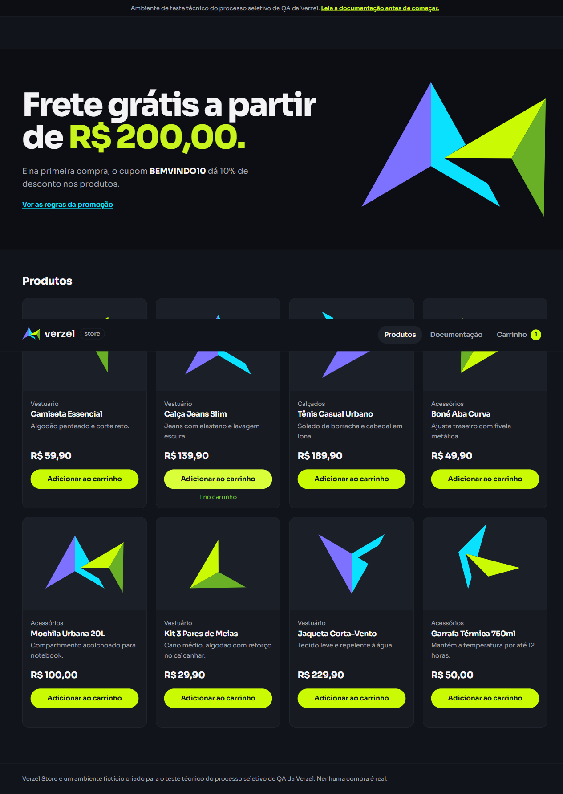


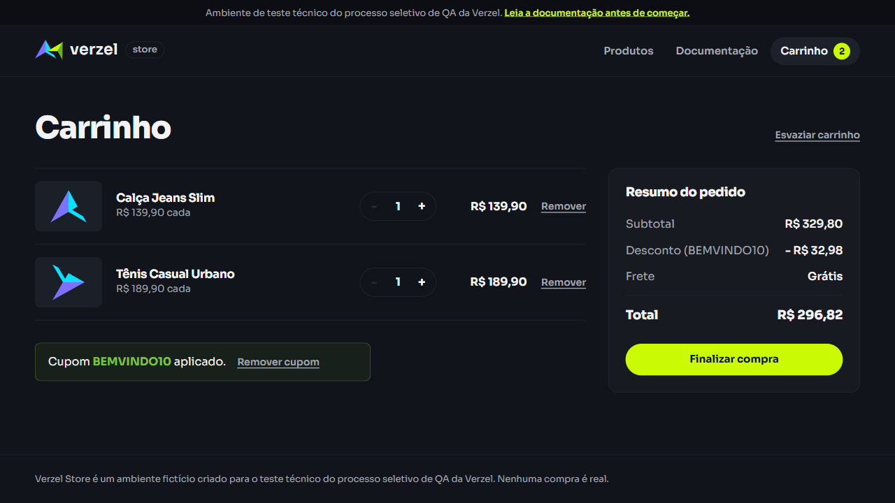
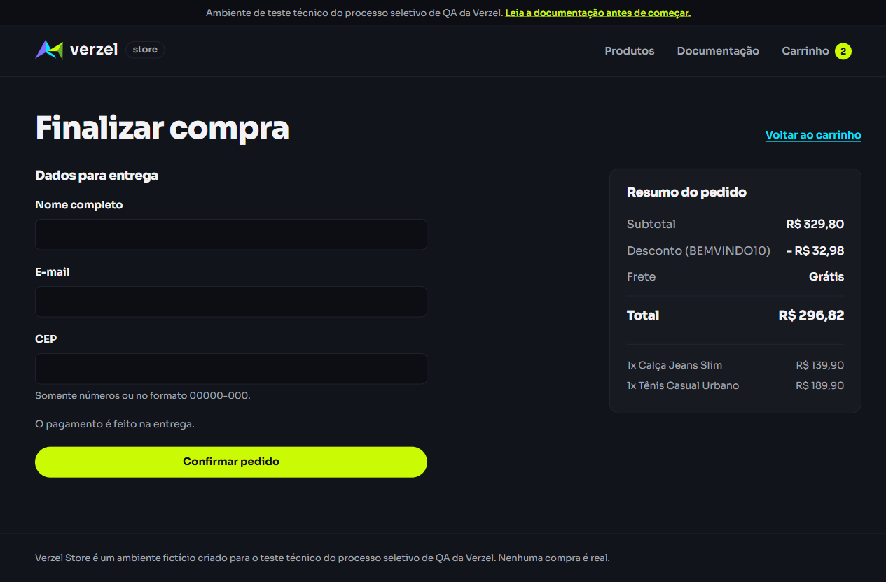
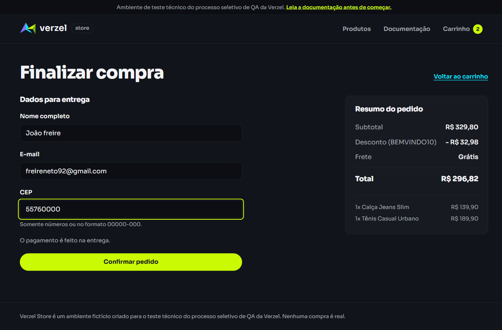
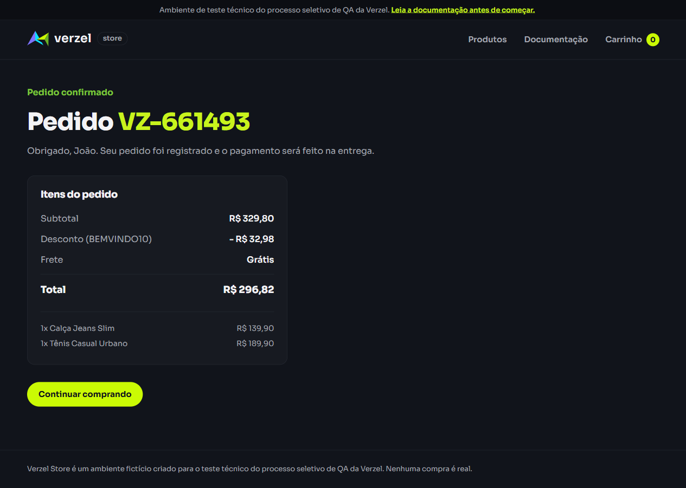


## Observações

O teste adiciona os produtos P002 e P003, aplica o cupom "BEMVINDO10" e valida a mensagem de aplicação do cupom. Em seguida, preenche os dados do cliente, confirma o pedido e verifica o retorno à loja.

---

# CT02 - Jornada de compra com cupom inválido

## Cenário

```gherkin
Scenario: Concluir uma compra após informar um cupom inválido

Given que acesso a loja e adiciono os produtos P001 e P005 ao carrinho
When informo o cupom "CUPOMINVALIDO"
Then o sistema deve exibir a mensagem "Cupom inválido."
When preencho os dados do cliente no checkout
And confirmo o pedido
Then o sistema deve exibir a confirmação do pedido
And devo conseguir retornar à loja
```

## Status

✅ APROVADO

## Evidências


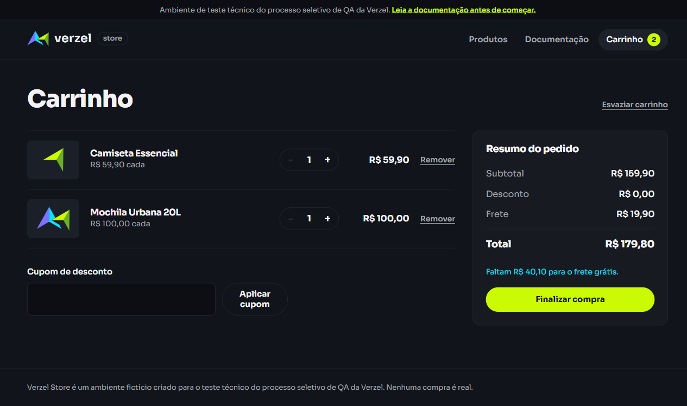
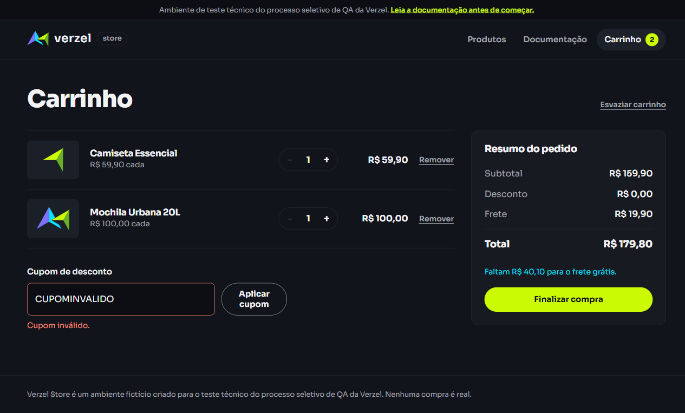
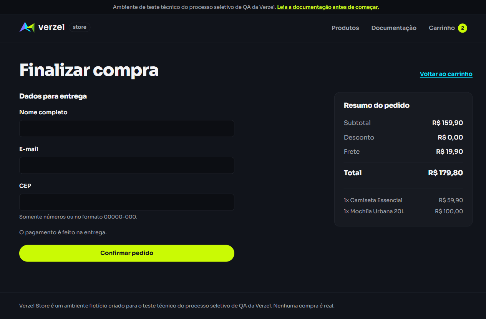
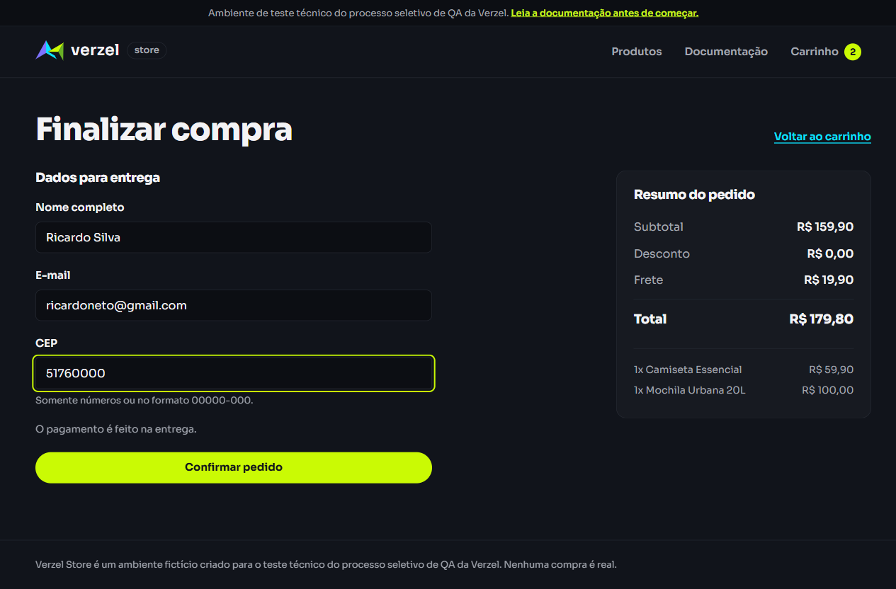
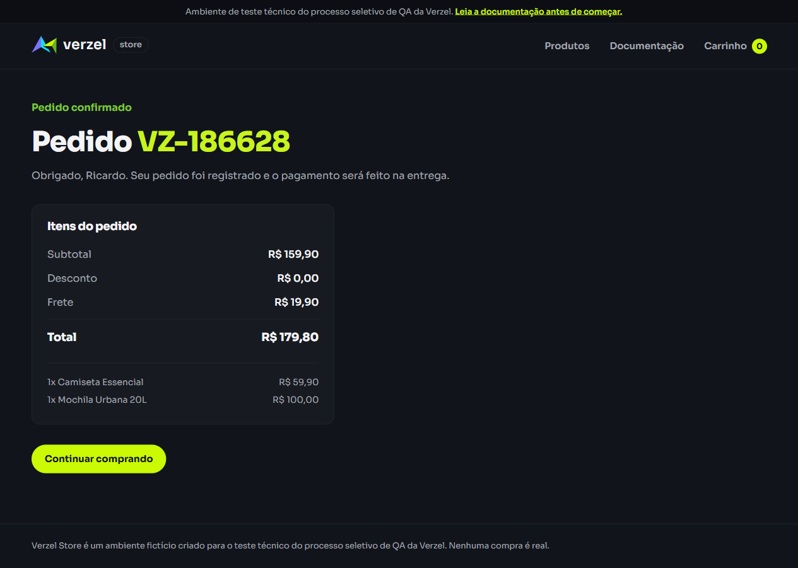


## Observações

O teste adiciona os produtos P001 e P005 e verifica que o cupom "CUPOMINVALIDO" é rejeitado com a mensagem esperada. A jornada prossegue pelo checkout até a confirmação do pedido.

---

# CT03 - Jornada de compra com cupom expirado

## Cenário

```gherkin
Scenario: Concluir uma compra após informar um cupom expirado

Given que acesso a loja e adiciono os produtos P005 e P003 ao carrinho
When informo o cupom expirado "VERAO2026"
Then o sistema deve exibir a mensagem "Cupom expirado."
When preencho os dados do cliente no checkout
And confirmo o pedido
Then o sistema deve exibir a confirmação do pedido
And devo conseguir retornar à lista de produtos
```

## Status

✅ APROVADO

## Evidências


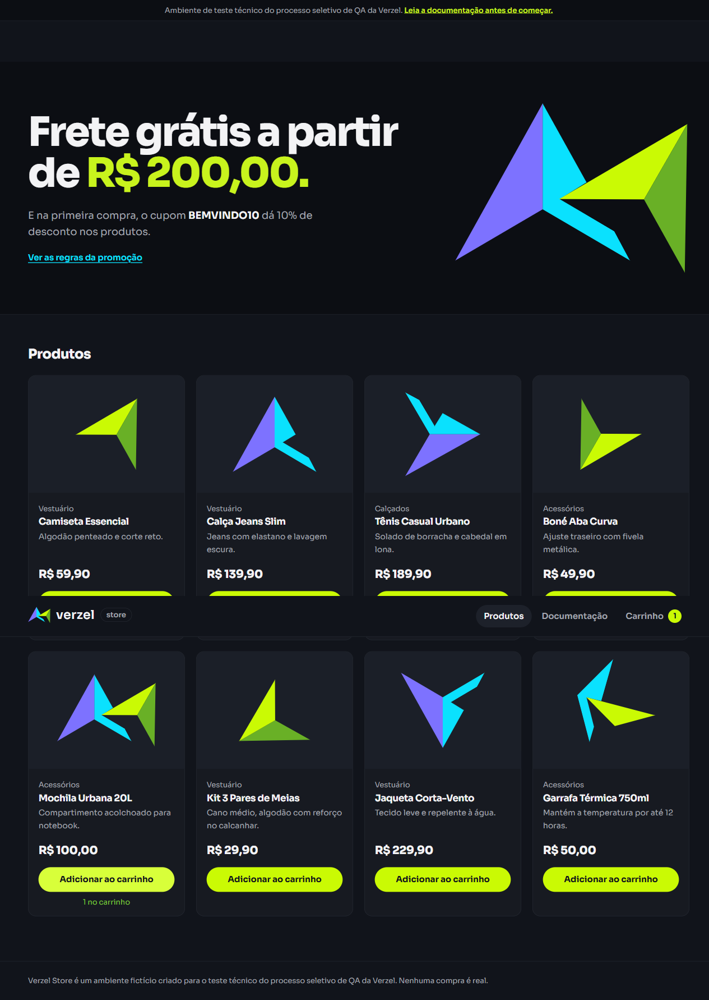

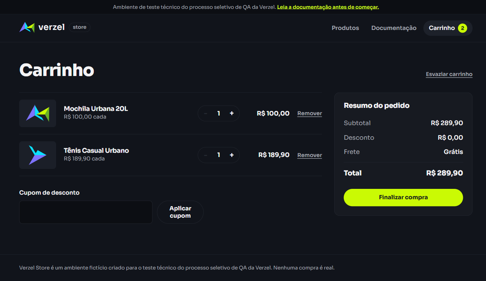
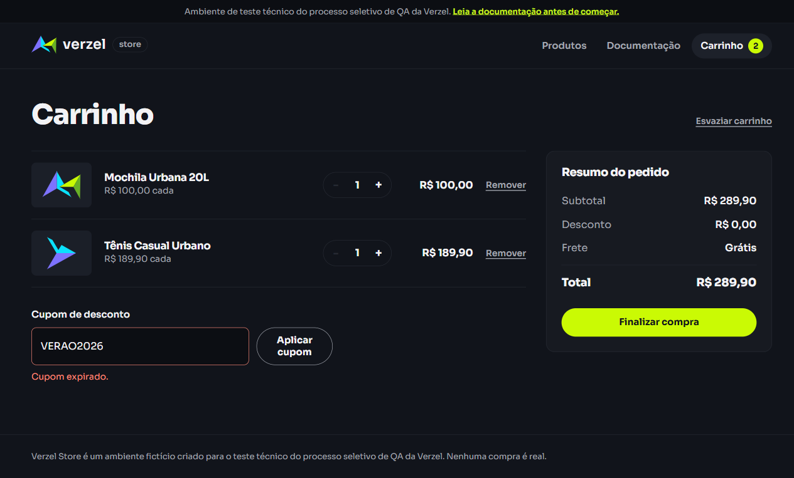

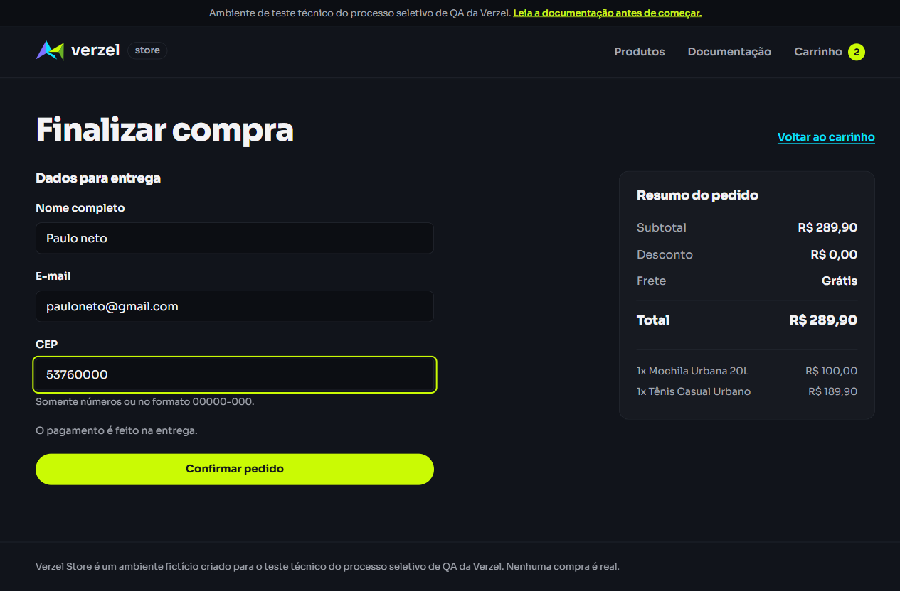


## Observações

O teste adiciona os produtos P005 e P003 e verifica que o cupom "VERAO2026" é identificado como expirado. A jornada prossegue pelo checkout até a confirmação do pedido e valida o retorno à lista de produtos.
