# Verzel Store - Testes Front-End
 
## Objetivo
 
Validar as funcionalidades da interface da aplicação Verzel Store, garantindo a aderência aos critérios de aceite e às regras de negócio relacionadas a cupons de desconto, frete, quantidade de produtos, formatação monetária e jornada completa de compra.
 
## Resumo da Execução
 
| Caso de Teste | Status |
|---------------|---------|
| CT01 | ✅ Aprovado |
| CT02 | ✅ Aprovado |
| CT03 | ✅ Aprovado |
| CT04 | ✅ Aprovado |
| CT05 | ✅ Aprovado |
| CT06 | ❌ Reprovado |
| CT07 | ✅ Aprovado |
| CT08 | ✅ Aprovado |
| CT09 | ✅ Aprovado |
| CT10 | ✅ Aprovado |
| CT11 | ✅ Aprovado |
| CT12 | ✅ Aprovado |
 
---
 
# CT01 - Aplicar cupom de desconto válido BEMVINDO10
 
## Cenário
 
```gherkin
Scenario: Aplicar cupom de desconto válido BEMVINDO10
 
Given que possuo um produto adicionado no carrinho
When preencho o campo de cupom de desconto com o valor "BEMVINDO10"
And aciono a opção "Aplicar cupom"
Then o sistema deve aplicar 10% de desconto sobre o subtotal do produto
And deve exibir uma mensagem de sucesso do cupom de desconto
And o valor total do pedido deve ser recalculado corretamente
```
 
## Status
 
✅ APROVADO
 
## Evidências
 


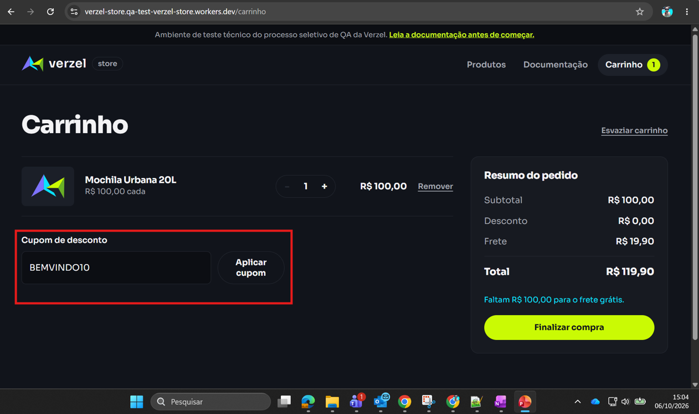
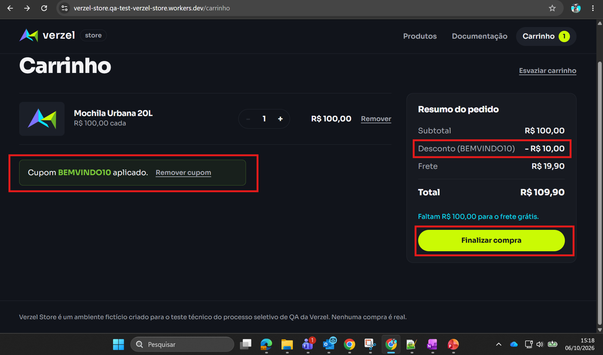
 
## Observações
 
Foi identificado que o valor do desconto não é aplicado diretamente sobre o campo de subtotal. O sistema apresenta o valor calculado no campo "Desconto", mantendo o subtotal original e refletindo corretamente o abatimento no valor total do pedido.
 
---
 
# CT02 - Aplicar cupom de desconto ignorando letras maiúsculas, minúsculas e espaços
 
## Cenário
 
```gherkin
Scenario Outline: Aplicar cupom de desconto ignorando letras maiúsculas, minúsculas e espaços
 
Given que possuo produtos adicionados ao carrinho
When preencho o campo de cupom de desconto com o valor "<cupom>"
And aciono a opção "Aplicar cupom"
Then o desconto de 10% deve ser aplicado sobre o subtotal dos produtos
 
Examples:
| cupom |
| bemvindo10 |
| BEMVINDO10 |
| BemVindo10 |
| BEMvINDO10 |
| bEMvINDO10 |
```
 
## Status
 
✅ APROVADO
 
## Evidências
 

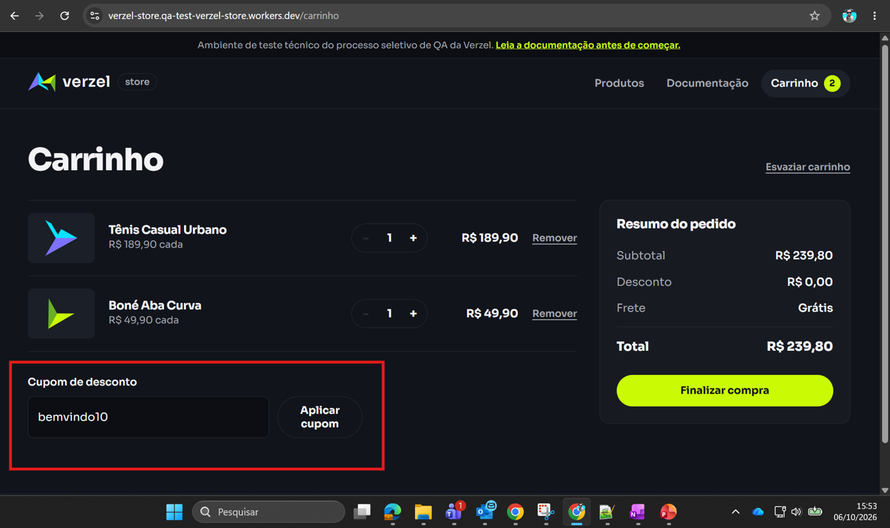

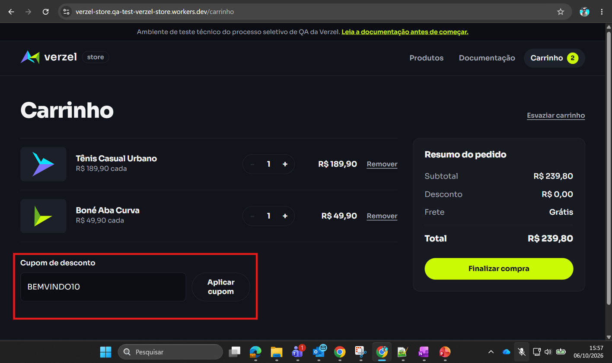
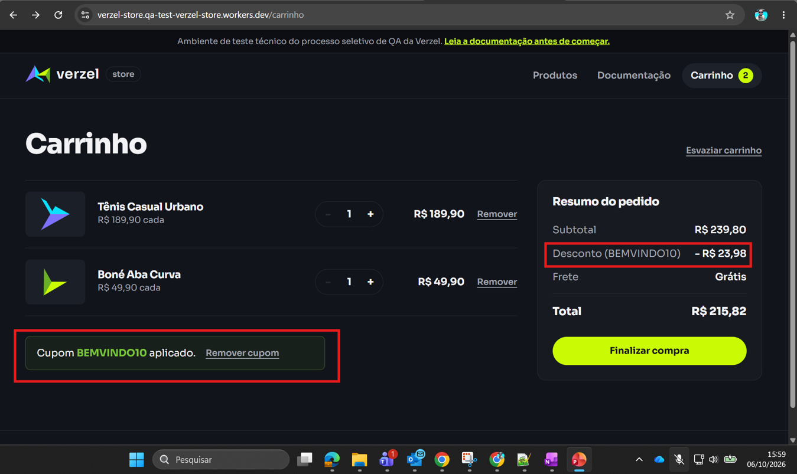
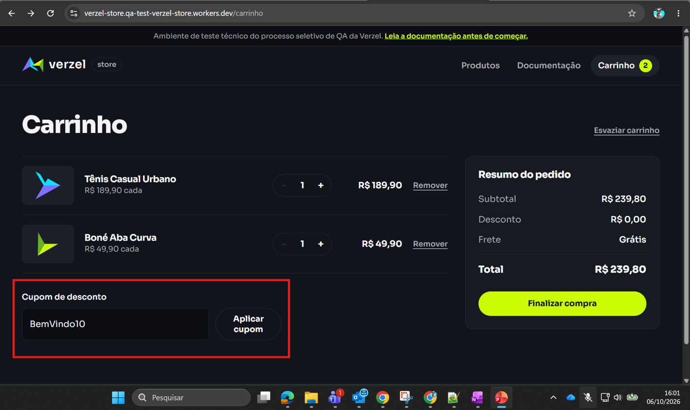

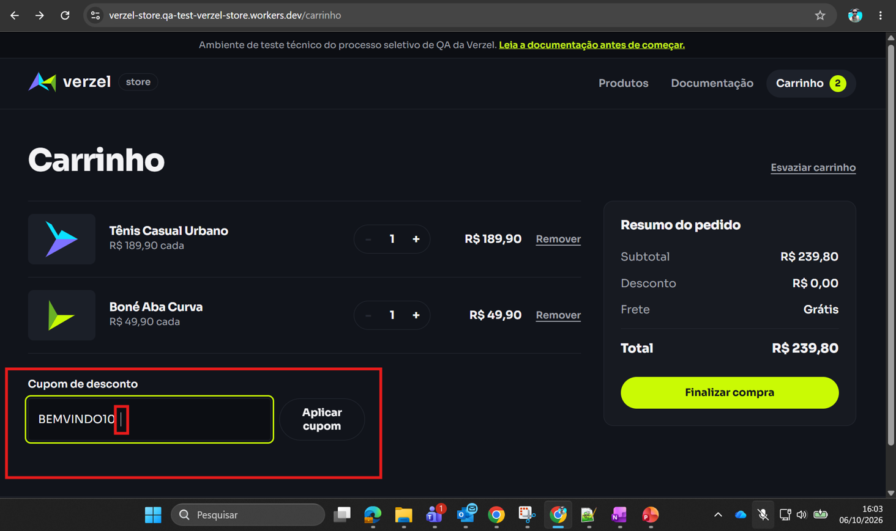

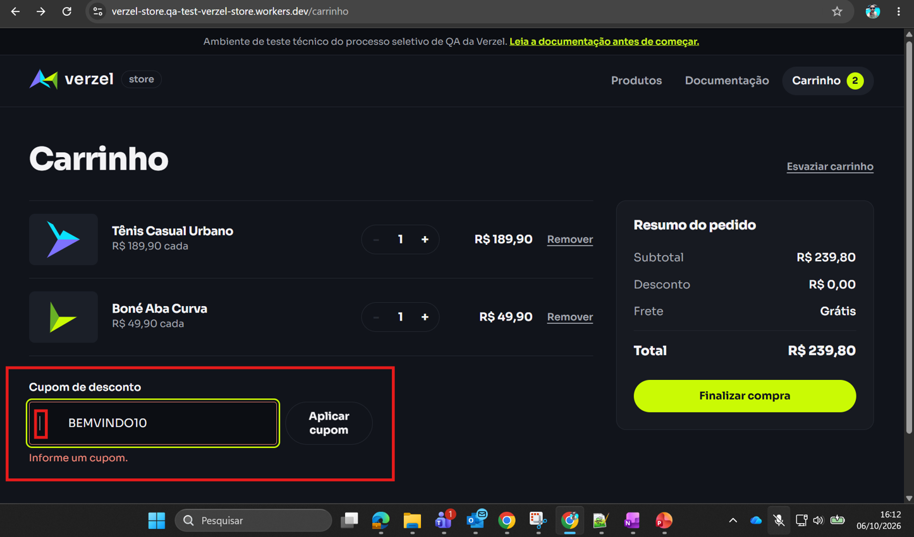
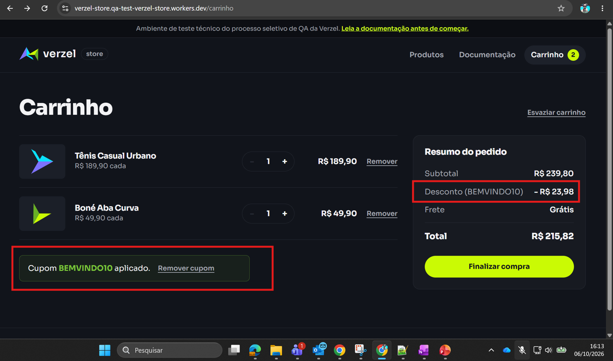
## Observações
 
A aplicação processou corretamente todas as variações informadas. Após a aplicação, a mensagem apresentada ao usuário padroniza o cupom como "BEMVINDO10".
 
---
 
# CT03 - Aplicar cupom de desconto inexistente
 
## Cenário
 
```gherkin
Scenario: Aplicar cupom de desconto inexistente
 
Given que possuo produtos adicionados ao carrinho
When preencho o campo de cupom de desconto com o valor "CUPOMTESTE"
And aciono a opção "Aplicar cupom"
Then o sistema deve exibir a mensagem "Cupom inválido."
And nenhum desconto deve ser aplicado ao subtotal dos produtos
And o valor total do pedido deve permanecer inalterado
```

## Status
 
✅ APROVADO
 
## Evidências
 

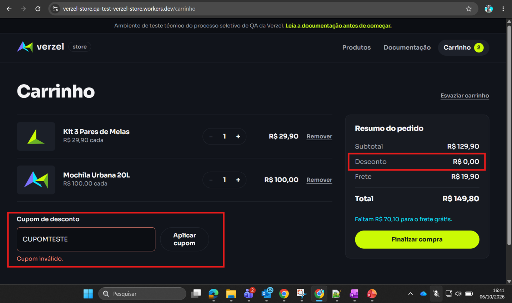
 
## Observações
 
Comportamento aderente à regra de negócio. O sistema apresentou a mensagem de cupom inválido e não aplicou desconto ao pedido.
 
---
 
# CT04 - Aplicar cupom de desconto expirado
 
## Cenário
 
```gherkin
Scenario: Aplicar cupom de desconto expirado
 
Given que possuo produtos adicionados ao carrinho
When preencho o campo de cupom de desconto com o valor "VERAO2026"
And aciono a opção "Aplicar cupom"
Then deve ser exibida a mensagem "Cupom expirado."
And nenhum desconto deve ser aplicado ao subtotal dos produtos
And o valor total do pedido deve permanecer inalterado
```

## Status
 
✅ APROVADO
 
## Evidências
 

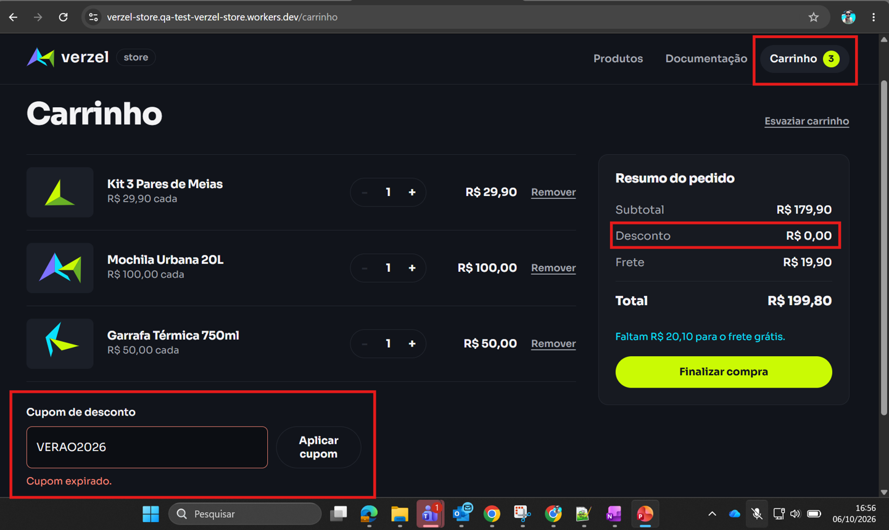
 
## Observações
 
Comportamento aderente à regra de negócio. O sistema apresentou corretamente a mensagem de cupom expirado e manteve os valores do pedido inalterados.
 
---
 
# CT05 - Aplicar um segundo cupom de desconto sem remover o atual
 
## Cenário
 
```gherkin
Scenario: Aplicar um segundo cupom de desconto sem remover o atual
 
Given que o cupom de desconto "BEMVINDO10" já está aplicado ao carrinho
When preencho o campo de cupom de desconto com o valor "VERAO2026"
And aciono a opção "Aplicar cupom"
Then o sistema não deve permitir a existência de dois cupons de desconto simultaneamente
And deve manter o cupom de desconto "BEMVINDO10" aplicado ao carrinho
```

## Status
 
✅ APROVADO
 
## Evidências
 

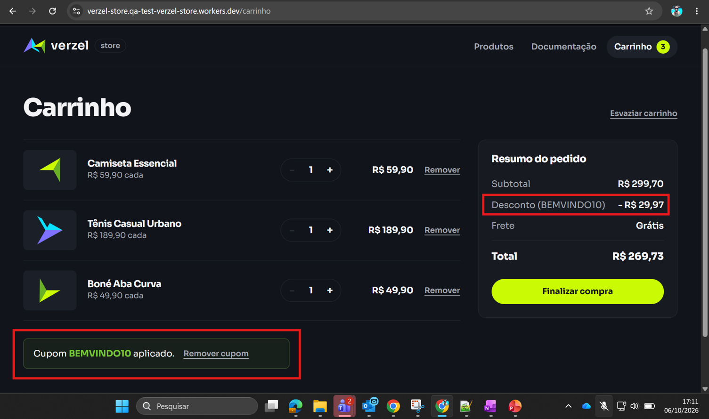
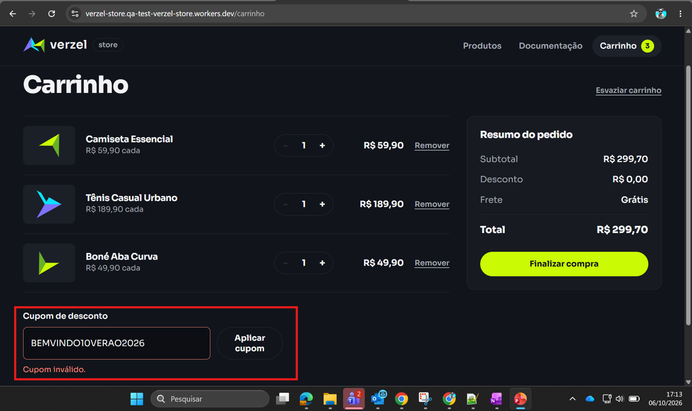
 
## Observações
 
A aplicação não permitiu a utilização simultânea de dois cupons e manteve ativo o cupom originalmente aplicado.
 
---
 
# CT06 - Frete grátis para compras com subtotal igual a R$ 200,00
 
## Cenário
 
```gherkin
Scenario: Frete grátis para compras com subtotal igual a R$ 200,00
 
Given que possuo produtos no carrinho com subtotal de R$ 200,00
When visualizo o resumo do pedido
Then o valor do frete deve ser igual a R$ 0,00
And o frete deve ser exibido como "Grátis"
```

## Status
 
❌ REPROVADO
 
## Evidências
 


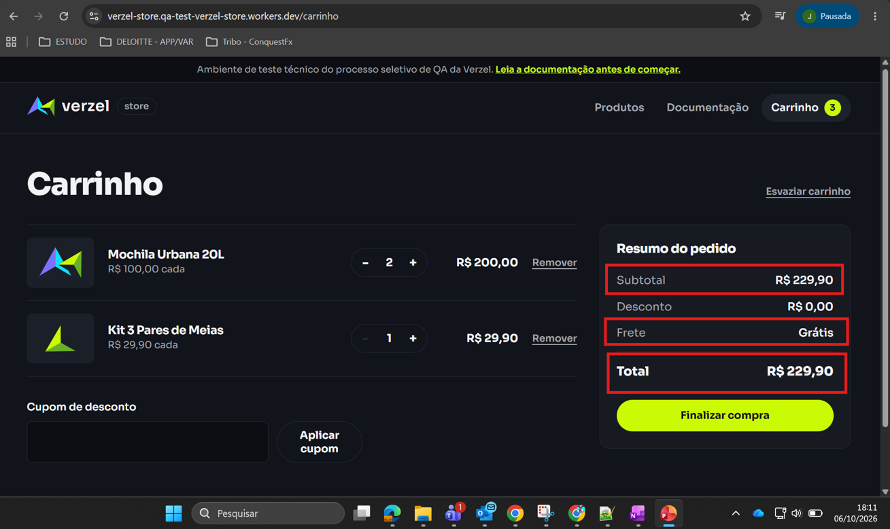
 
## Observações
 
Foi identificada divergência em relação ao critério de aceite CA06.
 
A documentação estabelece que o frete deve ser gratuito para compras com subtotal igual ou superior a R$ 200,00.
 
Durante a execução foi observado que um carrinho com subtotal exatamente igual a R$ 200,00 recebeu cobrança de frete no valor de R$ 19,90.
 
Ao repetir o teste com subtotal superior a R$ 200,00, o frete foi aplicado corretamente como gratuito.
 
Possível falha na validação do valor de fronteira, indicando que a implementação pode estar considerando:
 
```text
subtotal > 200
```
 
em vez de:
 
```text
subtotal >= 200
```
 
---
 
# CT07 - Cobrar frete fixo para subtotal inferior a R$ 200,00
 
## Cenário
 
```gherkin
Scenario: Cobrar frete fixo para subtotal inferior a R$ 200,00
 
Given que possuo produtos no carrinho com subtotal inferior a R$ 200,00
When visualizo o resumo do pedido
Then o valor do frete deve ser R$ 19,90
And deve ser informado o valor faltante para obtenção do frete grátis
```

## Status
 
✅ APROVADO
 
## Evidências
 


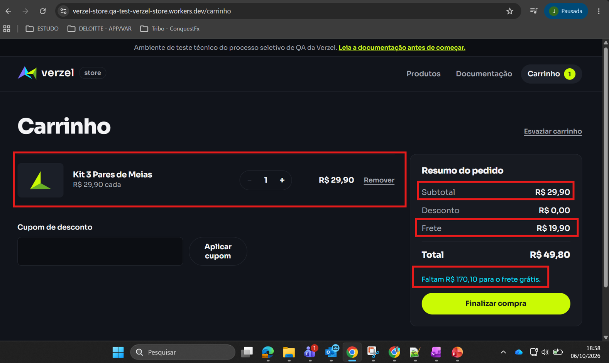
 
## Observações
 
O frete foi calculado corretamente em R$ 19,90 para compras abaixo do valor mínimo para obtenção do benefício de frete grátis.
 
---
 
# CT08 - Manter o frete grátis quando o subtotal após o desconto ficar inferior a R$ 200,00
 
## Cenário
 
```gherkin
Scenario: Manter o frete grátis quando o subtotal após o desconto ficar inferior a R$ 200,00
 
Given que possuo produtos no carrinho com subtotal superior a R$ 200,00
And preencho o campo de cupom de desconto com o valor "BEMVINDO10"
When aciono a opção "Aplicar cupom"
Then o desconto deve ser aplicado aos produtos do carrinho
And o valor final do pedido deve ficar inferior a R$ 200,00
And o frete deve permanecer gratuito
And o valor do frete deve ser igual a R$ 0,00
```

## Status
 
✅ APROVADO
 
## Evidências
 
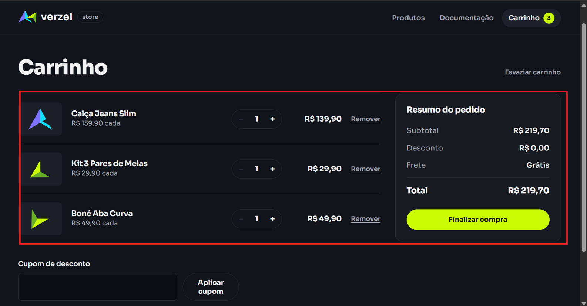
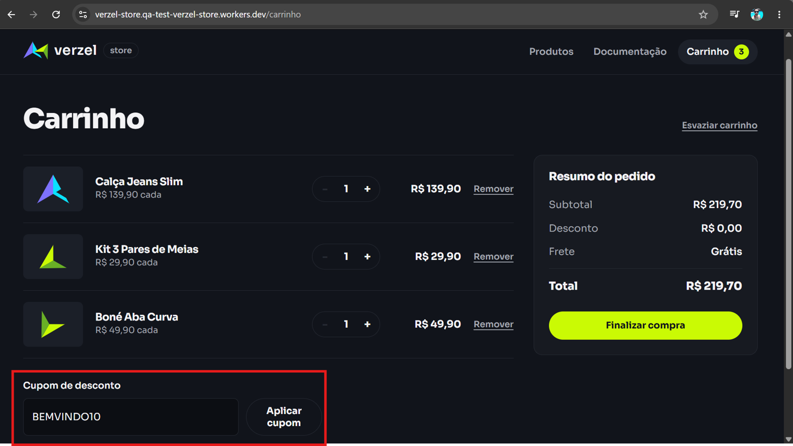
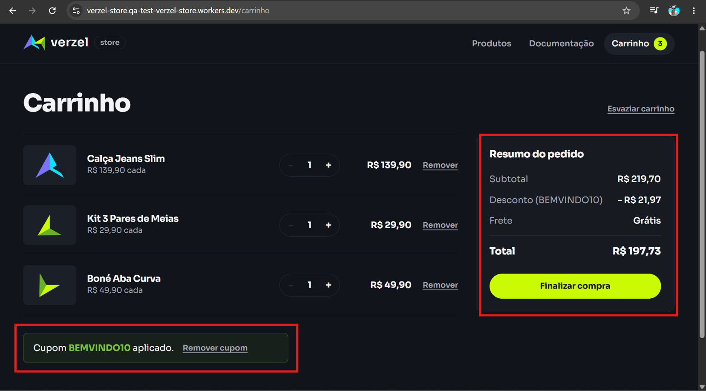
## Observações
 
Foi validado que a regra de frete grátis considera o subtotal antes da aplicação do desconto. Mesmo após o valor final ficar abaixo de R$ 200,00, o frete continuou gratuito.
 
---
 
# CT09 - Aplicar desconto apenas sobre o subtotal dos produtos
 
```gherkin
Scenario: Aplicar desconto apenas sobre o subtotal dos produtos
 
Given que possuo produtos no carrinho com subtotal inferior a R$ 200,00
And o frete do pedido é R$ 19,90
When preencho o campo de cupom de desconto com o valor "BEMVINDO10"
And aciono a opção "Aplicar cupom"
Then o desconto deve ser calculado apenas sobre o subtotal dos produtos
And o valor do frete deve permanecer R$ 19,90
```

## Status
 
✅ APROVADO
 
## Evidências
 
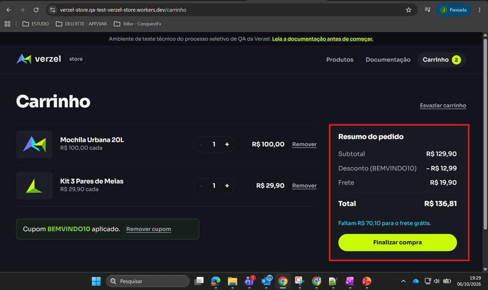
 
## Observações
 
O desconto foi aplicado somente sobre o subtotal dos produtos, sem qualquer influência sobre o valor do frete.
 
---
 
# CT10 - Permitir a quantidade máxima de 5 unidades do mesmo produto
 
## Cenário
 
```gherkin
Scenario: Permitir a quantidade máxima de 5 unidades do mesmo produto
 
Given que possuo um produto no carrinho
When altero sua quantidade para 5 unidades
Then o sistema deve aceitar a quantidade máxima permitida por produto
And o produto deve permanecer no carrinho
```

## Status
 
✅ APROVADO
 
## Evidências
 

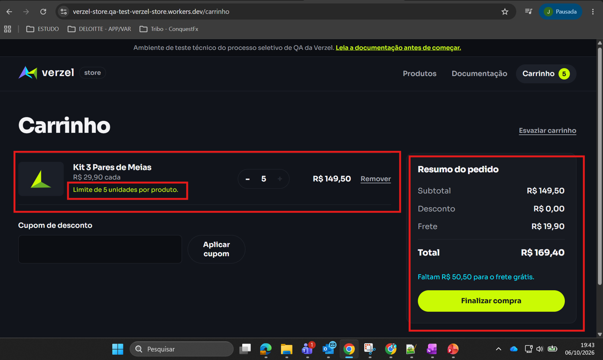
 
## Observações
 
A aplicação permitiu corretamente a inclusão de até 5 unidades do mesmo produto, conforme especificado na regra de negócio.
 
---
 
# CT11 - Exibir subtotal, desconto, frete e total formatados com duas casas decimais no resumo do pedido
 
## Cenário
 
```gherkin
Scenario: Exibir subtotal, desconto, frete e total formatados com duas casas decimais no resumo do pedido
 
Given que possuo produtos adicionados ao carrinho
When visualizo o resumo do pedido
Then os valores de subtotal, desconto, frete e total devem ser exibidos com duas casas decimais
```

## Status
 
✅ APROVADO
 
## Evidências
 
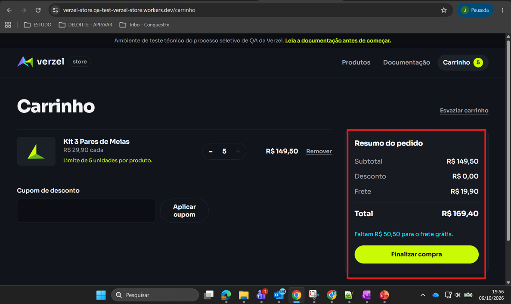
 
## Observações
 
Os valores monetários foram exibidos corretamente com duas casas decimais no resumo do pedido.
 
---
 
# CT12 - Validar a jornada completa de compra com sucesso
 
## Cenário
 
```gherkin
Scenario: Validar a jornada completa de compra com sucesso
 
Given que acesso a página inicial da loja
When adiciono produtos ao carrinho
And aplico um cupom de desconto válido
And informo nome, e-mail e CEP válidos para conclusão da compra
Then o pedido deve ser criado com sucesso
And o número do pedido deve ser exibido
And o desconto aplicado deve ser refletido no resumo do pedido
And os valores do pedido devem ser apresentados corretamente
```

## Status
 
✅ APROVADO
 
## Evidências
  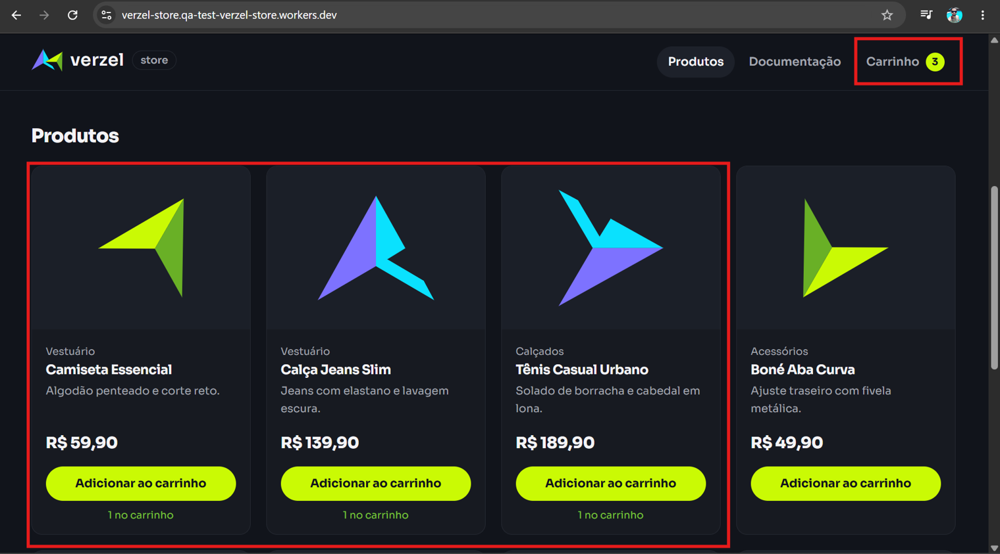
  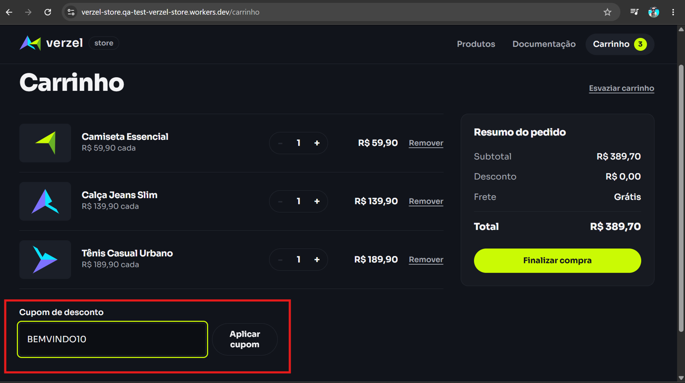
  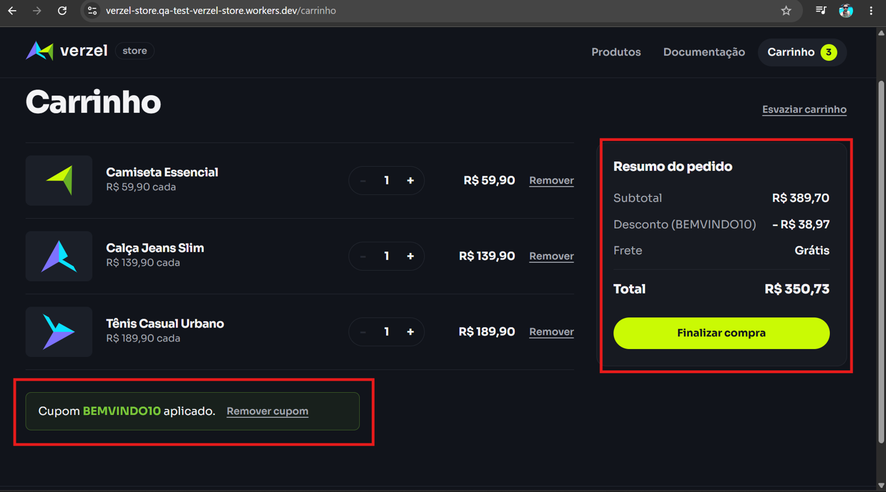
  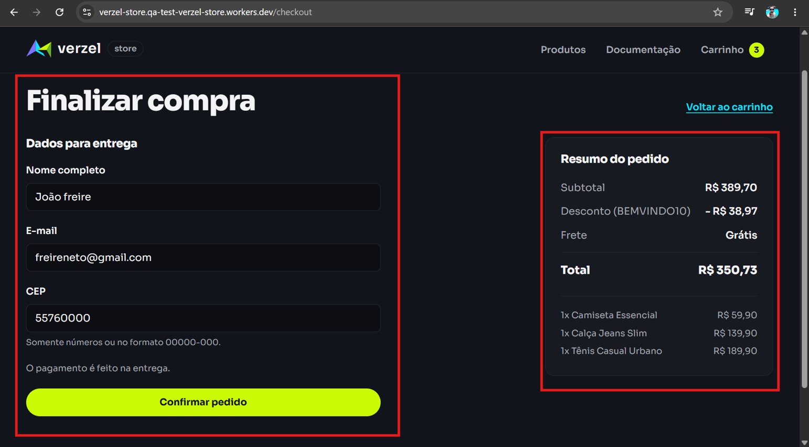
  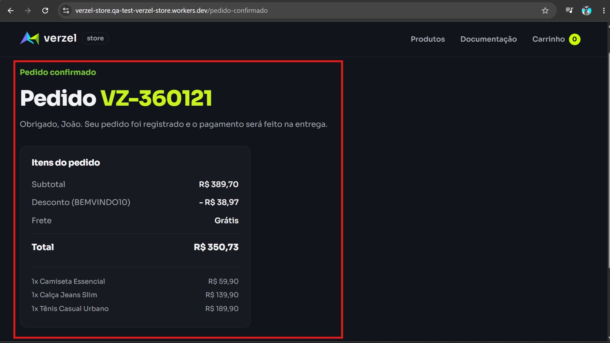
## Observações
 
A jornada completa da compra foi executada com sucesso, desde a seleção dos produtos até a criação do pedido, validando o funcionamento integrado das principais funcionalidades da aplicação.
 
---
 
## Conclusão
 
Dos 12 casos de teste executados no Front-End, 11 foram aprovados e 1 foi reprovado.
 
A principal divergência identificada está relacionada ao critério de aceite CA06, que não concede frete grátis para compras com subtotal exatamente igual a R$ 200,00, apesar da documentação indicar que o benefício deve ser aplicado para valores iguais ou superiores a esse montante.